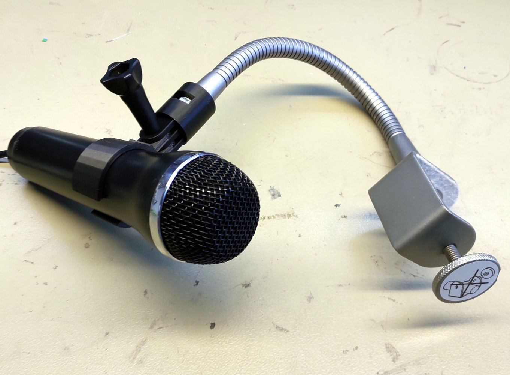

# Logitech gaming mic mount for an Ikea Kvart lamp stem
An action cam mount and gaming mic holder for Ikea Kvart lamps

There are three parts, a Kvart to action cam adapter, an action cam to microphone holder, and a pin which prints up the centre of the Kvart adapter.

What it does is best illustrated in the image below. The STL is best printed using supports over the bed because of the action cam lobes on the mic holder. There is also [a YouTube video in which I examine it in depth](https://www.youtube.com/watch?v=5zvgmXJs2yI).
 

## Licence

This library is licensed under the [Creative Commons Attribution Share Alike 4.0 International licence](license.md).

